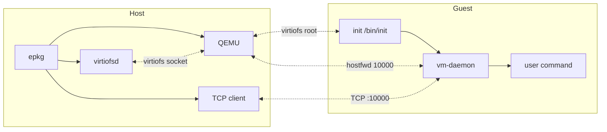
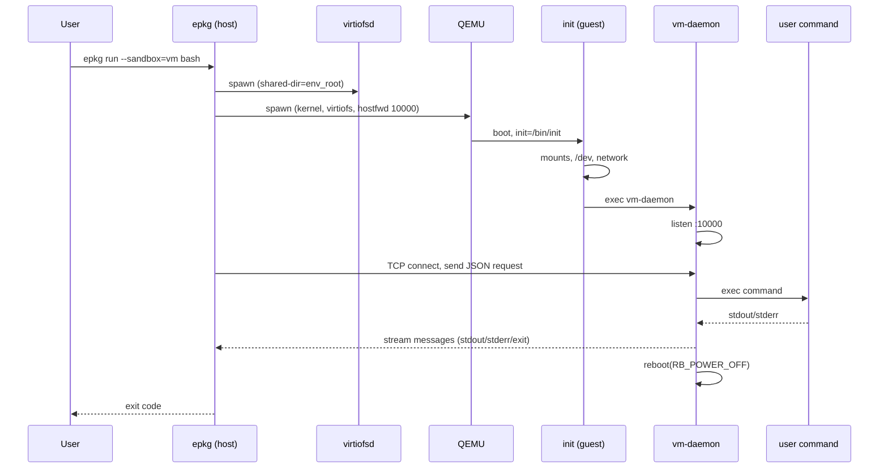
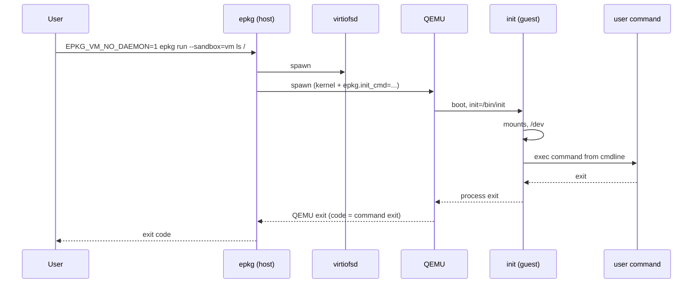

# VMM sandbox mode (`--sandbox=vm`)

When you use `epkg run --sandbox=vm`, epkg runs the command inside a lightweight VM. The environment root is shared into the guest via **virtiofs**; the guest sees it as its root filesystem. This document describes the design, execution paths, dependencies, and configuration.

## Contents

- [Overview](#overview)
- [Architecture](#architecture)
- [Execution paths summary](#execution-paths-summary)
- [Examples](#examples)
- [Dependencies](#dependencies)
- [Environment variables](#environment-variables)
- [Logs and debugging](#logs-and-debugging)
- [Optional and future work](#optional-and-future-work)

## Overview

- **Launcher**: epkg (on the host) starts **virtiofsd** to share the environment root directory, then starts a **QEMU** VM with a kernel (and optional initrd). The guest root is the virtiofs mount (tag `epkg_env`). Both virtiofsd and QEMU run **inside user/mount namespaces** similar to the **fs** sandbox mode, with the same UID/GID mapping (uidmap); only VM mode allows setgroups in the gid_map so virtiofsd can run.
- **Init**: The kernel boots with `init=/bin/init`, where `/bin/init` is a symlink to the epkg binary. epkg runs as the **init** applet: it mounts `/proc`, `/sys`, `/tmp`, sets up `/dev` (devtmpfs or tmpfs + minimal nodes, devpts), then either runs the user command (**cmdline mode**) or starts **vm-daemon** (control-channel mode).
- **Control-channel mode** (default): No command is passed via kernel cmdline. Init brings up the network (virtio_net, QEMU user networking), then execs **vm-daemon**. vm-daemon listens on vsock port 10000. The host connects via vsock (guest CID 3), sends a JSON command request, and receives stdout/stderr/exit over the same connection. After the command finishes, the daemon powers off the guest.
- **Cmdline mode** (`EPKG_VM_NO_DAEMON=1`): The command is passed via kernel cmdline (`epkg.init_cmd=...`, percent-encoded). Init execs that command directly (no vm-daemon). The host waits for QEMU to exit; the guest process exit code becomes the run exit code.

### High-level architecture



## Architecture

### Host side

1. **Namespace (same effect as sandbox=fs mode)**: The VM path runs in a **child process** that is created with user/mount namespace setup similar to the **fs** sandbox mode. That is: epkg creates the namespaces (via clone or unshare), applies the same UID/GID mapping (using `newuidmap`/`newgidmap` when available, or a simple idmap), and applies the mode-specific mount specs. One difference for VM mode is that **setgroups** is allowed when writing `gid_map` (so that virtiofsd, which runs inside this same namespace, can operate correctly; see virtio-fs/virtiofsd#36). **virtiofsd is then started inside this same user/mount namespace** — i.e. it is spawned as a child after the namespace and uidmap are in place, so it sees the same view of the filesystem and the same UID/GID mapping as the the **fs** sandbox. QEMU is also started in this same namespace.
2. **virtiofsd**: epkg spawns **virtiofsd** (inside the namespace described above) with `--shared-dir <env_root>`, `--socket-path <tmpdir>/vhostqemu.sock`, `--cache auto`, `--inode-file-handles=prefer`, `--sandbox none`. The daemon's stdout/stderr are redirected to a log file under the epkg cache.
3. **QEMU**: epkg builds a QEMU command line that:
   - Uses `-kernel` (and optionally `-initrd`) from `EPKG_VM_KERNEL` / `EPKG_VM_INITRD`, or a kernel found under `/boot`.
   - Passes `-enable-kvm`, `-cpu host`, `-m` (memory from `EPKG_VM_MEMORY` or `--memory`, default 2048 MiB; libkrun auto round-up so kernel fits), `-smp`, `-no-reboot`, `-nographic`.
   - Uses a **memory-backend-file** in `/dev/shm` (required for virtiofs).
   - Adds a **vhost-user-fs** device with the virtiofsd socket and tag `epkg_env`.
   - Adds **virtio-net** with user networking and `hostfwd=tcp::10000-:10000` (for control-channel mode).
   - Appends kernel cmdline: `console=ttyS0 panic=1 root=epkg_env rootfstype=virtiofs init=/bin/init sysctl.fs.file-max=1048576`, plus `epkg.init_cmd=...` in cmdline mode, and `epkg.rust_log=...` when `RUST_LOG` is set on the host.
4. **Guest init binary**: Before starting QEMU, epkg ensures the environment root has `/usr/bin/init` and `/usr/bin/vm-daemon` (symlinks or copies to the epkg binary so the guest can run `epkg init` and `epkg vm-daemon`). If epkg is outside the env (e.g. `target/debug/epkg`), the host bind-mounts the epkg binary directory into the env so the guest can find it.
5. **Host mounts for VM**: In addition to the virtiofs share, the host applies mount specs that include the epkg binary directory (when outside the env), `~/.epkg`, `~/.cache`, `/opt/epkg` (try), and `/lib/modules` (ro, try) so the guest can load e.g. `virtio_net`.

### Guest side (init)

1. **Early init**: Before full logging, init mounts `/proc` so it can read `epkg.rust_log` from `/proc/cmdline` and set `RUST_LOG` for the rest of init.
2. **Config**: Init reads working directory and command from (in order) CLI args, env vars (`EPKG_INIT_CWD`, `EPKG_INIT_CMD`), and kernel cmdline (`epkg.init_cwd`, `epkg.init_cmd`, the latter percent-encoded).

   | Source        | cwd                | command             |
   |---------------|--------------------|---------------------|
   | CLI           | `--cwd <DIR>`      | positional `[command] ...` |
   | Env           | `EPKG_INIT_CWD`    | `EPKG_INIT_CMD`     |
   | Kernel cmdline| `epkg.init_cwd=`   | `epkg.init_cmd=` (percent-encoded) |

3. **Mounts**: Remount root rw; apply VMM init mount specs: `/proc`, `/sys`, `/tmp`. Then create/mount `/dev` (devtmpfs or tmpfs), create minimal device nodes and symlinks, mount devpts at `/dev/pts`.
4. **chdir**: If `cwd` is set, `chdir(cwd)`.
5. **Command**:
   - If a command string is set: parse with shlex and `exec` it (with `/bin/sh -i` fallback on parse failure). If exec fails, try `/bin/sh -i`; if that fails, power off.
   - If no command (control-channel mode): Configure network (load `virtio_net`, discover interface, set IP 10.0.2.15/24, default route via 10.0.2.2), then `exec` vm-daemon.

### vm-daemon (guest, control-channel mode only)

- Listens on `0.0.0.0:10000`. Accepts **one** connection per VM lifetime.
- Reads one newline-terminated JSON **request** (e.g. `{"command":["/usr/bin/ls","/"], "pty": false}`).
- Runs the command either with **PTY** (`pty: true`) or with **pipes** (`pty: false`). For PTY: allocates a pseudo-terminal, forks, sets up session, execs command; forwards PTY output to TCP as base64 `stdout` messages; forwards TCP `stdin`/`resize`/`signal` to the process. For non-PTY: pipes for stdin/stdout/stderr, forwards output to TCP as it arrives.
- Sends newline-separated JSON **stream messages**: `stdout`, `stderr`, `exit` (and in PTY mode `resize`, `signal`). Then powers off the guest (`reboot(RB_POWER_OFF)`).

**Stream message types (TCP protocol):**

| Message   | Direction     | When / meaning |
|-----------|---------------|----------------|
| `stdout`  | Guest → Host  | Command stdout chunk (base64). |
| `stderr`  | Guest → Host  | Command stderr chunk (base64). |
| `exit`    | Guest → Host  | Command finished; `code` is exit status. |
| `stdin`   | Host → Guest  | Forward host stdin to command (base64). |
| `resize`  | Host → Guest  | PTY only; terminal rows/cols changed. |
| `signal`  | Host → Guest  | PTY only; e.g. `INT`, `TERM`, `WINCH`. |

### Host TCP client

- Connects to `127.0.0.1:10000` with retries (up to 30).
- Sends a single JSON request line (command, cwd, env, pty, terminal size).
- In **PTY mode**: raw terminal, SIGWINCH and Ctrl+C forwarded to guest; reads stream messages and decodes base64 stdout/stderr to the terminal (with `\n` → `\r\n` in raw mode).
- In **non-PTY mode**: reads stream messages and writes decoded stdout/stderr to host stdout/stderr; forwards stdin via `stdin` messages.
- Exits with the code from the `exit` message.

## Execution paths summary

| Mode              | Command from host      | Guest init                | Guest runs           | Host gets exit code from   |
|-------------------|------------------------|---------------------------|----------------------|----------------------------|
| Control-channel   | `epkg run --sandbox=vm …` | No cmd in cmdline         | vm-daemon → command  | TCP/vsock `exit` message   |
| Cmdline           | `EPKG_VM_NO_DAEMON=1 epkg run --sandbox=vm …` | `epkg.init_cmd=...` in cmdline | Command directly     | QEMU process exit code     |

Control-channel mode supports interactive use (PTY) and streaming output; cmdline mode avoids network setup in the guest and is simpler for single-shot commands when cmdline length is acceptable.

### Control-channel mode sequence (simplified)



### Cmdline mode sequence (simplified)



## Examples

### Basic command examples

| Goal | Command |
|------|---------|
| Interactive shell (PTY) | `epkg -e myenv run --sandbox=vm --tty bash` |
| Run one command, see output | `epkg -e myenv run --sandbox=vm ls /` |
| Capture output in a variable | `out=$(epkg -e myenv run --sandbox=vm --no-tty cat /etc/os-release)` |
| Cmdline (no guest network) | `EPKG_VM_NO_DAEMON=1 epkg -e myenv run --sandbox=vm ls /` |
| With timeout (avoid hang) | `timeout 30 epkg -e myenv run --sandbox=vm python3 script.py` |
| Debug host and guest | `RUST_LOG=debug epkg -e myenv run --sandbox=vm --tty bash` |

### Selecting the VMM backend (`--vmm`)

When `--sandbox=vm` is used, epkg can try multiple VMM backends in order. The
`--vmm` option takes a comma-separated list of backend names:

- `libkrun` — libkrun-based microVM backend (available when epkg is built with the
  `libkrun` Cargo feature, and libkrunfw is installed in the env).
- `qemu` — QEMU + virtiofs backend described in this document.

Examples:

```bash
# Prefer libkrun, fall back to QEMU if libkrun is unavailable or fails
epkg -e myenv run --sandbox=vm --vmm=libkrun,qemu bash

# Force QEMU even if epkg was built with libkrun support
epkg -e myenv run --sandbox=vm --vmm=qemu bash
```

If `--vmm` is not specified:

- When epkg is built **with** the `libkrun` feature, the default order is
  `libkrun,qemu` (try libkrun first, then QEMU).
- When built **without** `libkrun`, the default is `qemu` only.

If a backend in the list is not available (e.g. feature disabled, missing
binary, or runtime error), epkg logs a warning and tries the next backend.

### Example: JSON request (control-channel mode)

The host sends a single newline-terminated JSON object to the guest vm-daemon. Example for a non-PTY run:

```json
{"command":["/usr/bin/ls","-la","/"],"cwd":null,"env":{},"stdin":"","pty":false}
```

Example for an interactive PTY run (with terminal size):

```json
{"command":["/usr/bin/bash"],"cwd":null,"env":{},"stdin":"","pty":true,"terminal":{"rows":24,"cols":80}}
```

### Example: Kernel cmdline (control-channel vs cmdline mode)

**Control-channel mode** — no command in cmdline; init will start vm-daemon:

```
console=ttyS0 panic=1 root=epkg_env rootfstype=virtiofs init=/bin/init sysctl.fs.file-max=1048576 epkg.rust_log=debug
```

**Cmdline mode** — command is percent-encoded in `epkg.init_cmd`:

```
console=ttyS0 panic=1 root=epkg_env rootfstype=virtiofs init=/bin/init sysctl.fs.file-max=1048576 epkg.init_cmd=%2Fusr%2Fbin%2Fls%20%2F
```

(Decoded: `/usr/bin/ls /`.)

### Example: Inspecting VMM logs

```bash
# Latest QEMU and virtiofsd logs (symlinks)
tail -f ~/.cache/epkg/vmm-logs/latest-qemu.log
tail -f ~/.cache/epkg/vmm-logs/latest-virtiofsd.log

# When RUST_LOG=debug, QEMU stdout/stderr
ls -la ~/.cache/epkg/vmm-logs/*.stdout.log ~/.cache/epkg/vmm-logs/*.stderr.log
```

## Dependencies

- **QEMU** (e.g. `qemu-system-x86_64`) with KVM, vhost-user-fs, and user networking. Override with `EPKG_VM_QEMU`.
- **virtiofsd** (usually from the same QEMU/virtiofs package). Must be on PATH or set `EPKG_VM_VIRTIOFSD`.
- **Kernel**: A Linux kernel the guest can boot. By default epkg looks under `/boot` for a host kernel (e.g. `vmlinuz-$(uname -r)`); you can set `EPKG_VM_KERNEL` to a path. For production you may use a minimal guest kernel and optional initrd.
- **Optional initrd**: `EPKG_VM_INITRD` to pass an initrd to QEMU.
- **Modules in guest**: For control-channel mode the guest needs network; init loads `virtio_net` (and its dependencies `failover/net_failover`). The host mounts `/lib/modules` into the env so the guest can load modules (see `vm_mount_spec_strings`).

## Environment variables

| Variable              | Purpose |
|-----------------------|--------|
| `EPKG_VM_KERNEL`      | Path to kernel image (default: auto-detect under `/boot`). |
| `EPKG_VM_INITRD`      | Optional path to initrd. |
| `EPKG_VM_QEMU`        | QEMU binary (default: `qemu-system-x86_64`). |
| `EPKG_VM_VIRTIOFSD`   | virtiofsd binary (default: `virtiofsd`). |
| `EPKG_VM_MEMORY`      | Guest RAM in MiB or size (e.g. 2G). Default: 2048. For libkrun, memory is auto round-up so kernel fits (kernel loads at 2 GiB). |
| `EPKG_QEMU_EXTRA_ARGS` | Extra arguments appended to the QEMU kernel cmdline (legacy: `EPKG_VM_EXTRA_ARGS`). |
| `EPKG_VM_NO_DAEMON`    | If set, use cmdline mode: init runs command from kernel cmdline, no vm-daemon. |
| `RUST_LOG`            | If set, passed into guest as `epkg.rust_log` for init/vm-daemon logging. |

## Logs and debugging

- **VMM logs**: Under `{epkg_cache}/vmm-logs/` (e.g. `~/.cache/epkg/vmm-logs/`). PID-based files: `qemu-<pid>.log`, `virtiofsd-<pid>.log`; symlinks `latest-qemu.log`, `latest-virtiofsd.log` point to the most recent run. When `RUST_LOG` is at debug or trace, QEMU stdout/stderr are also written to `*.stdout.log` and `*.stderr.log`.
- **Serial**: QEMU serial output is written to the same path as the QEMU log (serial log path is the qemu log path in the current implementation).
- **Debug**: Run with `RUST_LOG=debug epkg run --sandbox=vm --tty bash` to see host and guest logs. In PTY mode, `env_logger` writes to stderr and may look misaligned with raw terminal output; that's expected.
- **Timeouts**: Use `timeout 10 epkg run --sandbox=vm ...` to avoid hanging if the guest never connects or never exits.

## Optional and future work

- **Other VMMs**: The design (virtiofs + init applet + optional vm-daemon) could be adapted to Cloud-Hypervisor, microvm, or other VMMs with virtiofs and a way to pass kernel cmdline and serial output.
- **Pre-built guest image**: A minimal rootfs or initrd with only the necessary tools (and epkg as init/vm-daemon) could reduce dependency on the host kernel and `/lib/modules` and speed boot.
