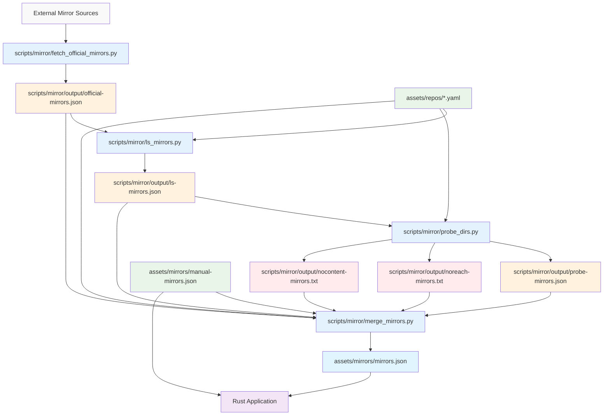
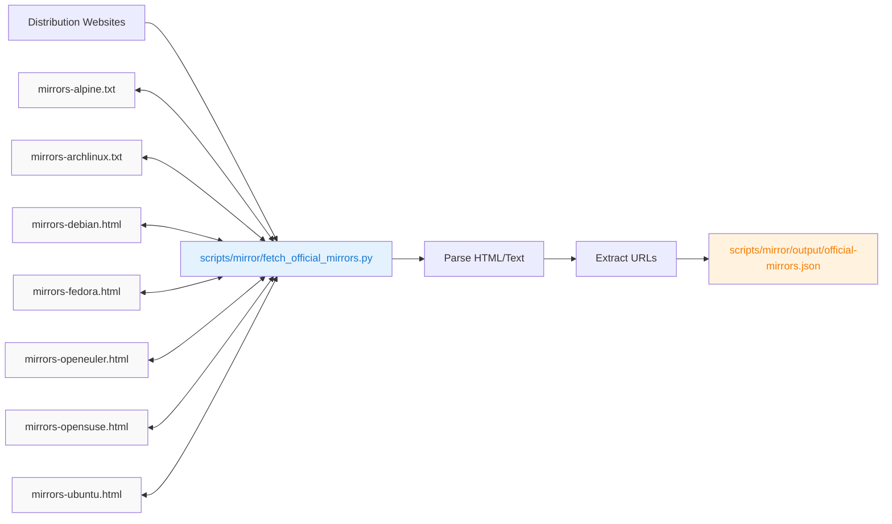
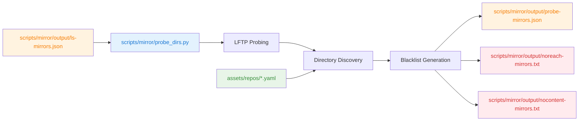
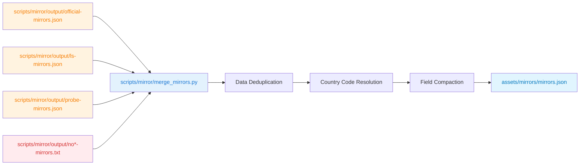
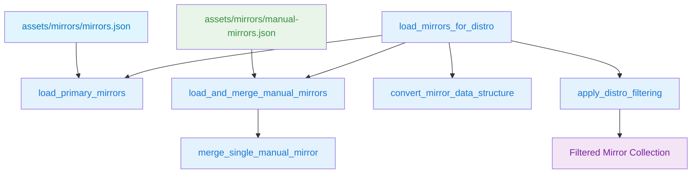

# Mirror Management System Documentation

This document describes the mirror management system used in epkg, including its architecture, data flows, and usage instructions.

## Directory Structure

```
/c/epkg/
├── assets/
│   ├── mirrors/                      # Mirror configurations
│   │   ├── manual-mirrors.json       # Manual mirror configurations
│   │   └── mirrors.json              # Final mirror database
│   └── repos/                        # Distribution configs
│       ├── ubuntu.yaml               # Ubuntu distribution config
│       ├── debian.yaml               # Debian distribution config
│       ├── fedora.yaml               # Fedora distribution config
│       ├── archlinux.yaml            # Arch Linux distribution config
│       ├── alpine.yaml               # Alpine distribution config
│       └── *.yaml                    # Other distribution configs
│
└── scripts/mirror/                  # Processing scripts directory
    ├── *.py                         # Python processing scripts
    ├── Makefile                     # Automation Makefile
    ├── html-cache/                  # HTML and JS-rendered cache
    ├── lftp-cache/                  # LFTP directory listing cache
    ├── input/                       # Downloaded mirror lists
    │   ├── mirrors-alpine.txt       # Alpine Linux official mirror list
    │   ├── mirrors-archlinux.txt    # Arch Linux official mirror list
    │   ├── mirrors-debian.html      # Debian official mirror list
    │   ├── mirrors-fedora.html      # Fedora official mirror list
    │   ├── mirrors-openeuler.html   # openEuler official mirror list
    │   ├── mirrors-opensuse.html    # openSUSE official mirror list
    │   └── mirrors-ubuntu.html      # Ubuntu official mirror list
    ├── output/                      # Generated files directory
    │   ├── official-mirrors.json    # Newly discovered mirrors
    │   ├── ls-mirrors.json          # Directory listings from mirrors
    │   ├── probe-mirrors.json       # Probed directory information
    │   ├── noreach-mirrors.txt      # Network unreachable mirrors
    │   ├── nocontent-mirrors.txt    # Mirrors with no content
    │   └── failed-mirrors.log       # Log of failed mirror fetches
    └── *.txt                        # Other text files (blacklist, etc.)
```

## Usage Instructions

### Prerequisites
```shell
# Setup epkg environment in scripts/mirror/
cd scripts/mirror/
epkg env create --root ".eenv" -c debian
# below epkg commands will auto find-use the env at CWD/.eenv
epkg install python3-pip geoip-database chromium-driver lftp
epkg run pip install -r requirements.txt
```

Alternatively, you can use the Makefile target:
```shell
make init
```

### Step-by-Step Workflow

#### 1. Fetch New Mirrors
```shell
cd scripts/mirror/

# Discovers mirrors from official distribution sources
# Input: input/mirrors-*.html, input/mirrors-*.txt (downloaded from distribution websites)
# Output: output/official-mirrors.json
epkg run fetch_official_mirrors.py
```

#### 2. List Directory Contents
```shell
cd scripts/mirror/

# Fetches directory listings from discovered mirrors
# Input: output/official-mirrors.json + previous output/ls-mirrors.json + assets/repos/*.yaml
# Output: updated output/ls-mirrors.json
epkg run ls_mirrors.py

```

#### 3. Probe Unknown Mirrors
```shell
cd scripts/mirror/

# Probes mirrors without directory listings
# Input: output/ls-mirrors.json + assets/repos/*.yaml
# Output: output/probe-mirrors.json + output/noreach-mirrors.txt + output/nocontent-mirrors.txt
epkg run probe_dirs.py
```

#### 4. Update Manual Configuration
ls_mirrors.py will print recommendations for `assets/mirrors/manual-mirrors.json`:
```json
"http://mirror.example.com":{"cc":"US","ls":["ubuntu","debian"]},
```

Copy/paste relevant entries to `assets/mirrors/manual-mirrors.json`:
```shell
# Edit manual configuration
vim assets/mirrors/manual-mirrors.json
```

#### 5. Generate Final Configuration
```shell
cd scripts/mirror/

# Merges all data sources into final configuration
# Input: All JSON files + assets/mirrors/manual-mirrors.json + error files
# Output: assets/mirrors/mirrors.json
epkg run merge_mirrors.py
```

## Makefile Automation

A Makefile is provided to automate the pipeline execution. It defines targets for each stage and handles dependencies between them.

### Available Targets
```shell
cd scripts/mirror/
make help               # Show available targets and usage
make all                # Run complete pipeline (stages 1-4)
make stage1             # Fetch new mirrors from official sources
make stage2             # List directory contents from discovered mirrors
make stage3             # Probe unknown mirrors for directory structure
make stage4             # Merge all data into final configuration
make init               # Create directories and setup epkg environment
make clean-cache        # Clean HTML and LFTP cache files
make clean              # Clean all generated files (except input/cache files)
```

### Usage Examples
```shell
# Run complete pipeline
make all

# Run only specific stages
make stage1
make stage2

# Setup environment and directories
make init

# Clean generated files
make clean
```

The Makefile uses `epkg run` for all Python script execution and automatically detects the epkg environment in `./.eenv`.

## Debugging and Maintenance

### Common Debug Commands
```shell
cd scripts/mirror/

# Parse a single HTML file for testing
epkg run ls_mirrors.py --parse html-cache/example.com.html

# Check certificate issues
grep -l certificate lftp-cache/*.lftp

# Remove problematic cache files
rm $(grep -l certificate lftp-cache/*.lftp)

# Study directory patterns
rg "=ubuntu" html-cache/*.html
```

### File Inspection Commands
```shell
# Check processing files
ls scripts/mirror/output/*.json
ls scripts/mirror/output/*.txt

# Check final output
ls assets/mirrors/*.json

# Check distribution configs
ls assets/repos/*.yaml

# Check downloaded mirror lists
ls scripts/mirror/input/mirrors-*

# Monitor cache usage
du -sh html-cache/ lftp-cache/
```

### Cache Management
```shell
cd scripts/mirror/

# Clean HTML cache
rm html-cache/*.html

# Clean LFTP cache
rm lftp-cache/*.lftp
```

## Error Handling

### Common Failure Modes
1. **Network Issues**: Timeouts, connection refused, DNS failures
2. **Content Issues**: JavaScript-only sites, custom formats, redirects
3. **Certificate Problems**: Expired/invalid SSL certificates
4. **Rate Limiting**: Server-side request throttling

### File-Specific Error Handling
| Error Type | Affected Files | Location | Resolution |
|------------|----------------|----------|------------|
| Network failures | `noreach-mirrors.txt` | `scripts/mirror/output/` | Review and retry |
| Content issues | `nocontent-mirrors.txt` | `scripts/mirror/output/` | Manual investigation |

### Mitigation Strategies
- Multiple parsing strategies for HTML content
- JavaScript rendering fallback for dynamic sites
- LFTP fallback for HTTP parsing failures
- Comprehensive blacklisting of problematic mirrors
- GeoIP-based country resolution as fallback

## Configuration Files

### DISTRO_CONFIGS Structure
Located in: `assets/repos/*.yaml` (one file per distribution)

Each distribution configuration file maps the distribution name to its expected directory structures:

**Example `assets/repos/ubuntu.yaml`:**
```yaml
distro_dirs:
  - ubuntu
  - ubuntu-ports
  - ubuntu-releases
  - ubuntu-security
```

**Example `assets/repos/debian.yaml`:**
```yaml
distro_dirs:
  - debian
  - debian-security
  - debian-multimedia
  - debian-backports
```

**Example `assets/repos/archlinux.yaml`:**
```yaml
distro_dirs:
  - archlinux
  - archlinux-arm
  - archlinuxcn
```

These configuration files drive the directory filtering logic across all scripts. The `distro_dirs` values are used to filter mirror directory listings to only include directories that match known distribution patterns.

## System Architecture



## File System Overview

### Input Files (External Sources)
| File | Path | Purpose | Format | Source |
|------|------|---------|--------|--------|
| `mirrors-alpine.txt` | `scripts/mirror/input/` | Alpine Linux official mirror list | Plain text | Downloaded |
| `mirrors-archlinux.txt` | `scripts/mirror/input/` | Arch Linux official mirror list | Plain text | Downloaded |
| `mirrors-debian.html` | `scripts/mirror/input/` | Debian official mirror list | HTML | Downloaded |
| `mirrors-fedora.html` | `scripts/mirror/input/` | Fedora official mirror list | HTML | Downloaded |
| `mirrors-openeuler.html` | `scripts/mirror/input/` | openEuler official mirror list | HTML | Downloaded |
| `mirrors-opensuse.html` | `scripts/mirror/input/` | openSUSE official mirror list | HTML | Downloaded |
| `mirrors-ubuntu.html` | `scripts/mirror/input/` | Ubuntu official mirror list | HTML | Downloaded |

### Configuration Files
| File | Path | Purpose | Format | Usage |
|------|------|---------|--------|-------|
| `ubuntu.yaml` | `assets/repos/` | Ubuntu distribution directory mappings | YAML | Directory filtering |
| `debian.yaml` | `assets/repos/` | Debian distribution directory mappings | YAML | Directory filtering |
| `fedora.yaml` | `assets/repos/` | Fedora distribution directory mappings | YAML | Directory filtering |
| `archlinux.yaml` | `assets/repos/` | Arch Linux distribution directory mappings | YAML | Directory filtering |
| `alpine.yaml` | `assets/repos/` | Alpine distribution directory mappings | YAML | Directory filtering |
| `*.yaml` | `assets/repos/` | Other distribution configs | YAML | Directory filtering |

### Manual Configuration Files
| File | Path | Purpose | Format | Maintenance |
|------|------|---------|--------|-------------|
| `manual-mirrors.json` | `assets/repos/` | Manually curated mirror configurations | JSON (linewise) | Manual editing |

### Intermediate Processing Files
| File | Path | Purpose | Generated By | Used By |
|------|------|---------|--------------|---------|
| `official-mirrors.json` | `scripts/mirror/output/` | Newly discovered mirrors | `fetch_official_mirrors.py` | `ls_mirrors.py`, `merge_mirrors.py` |
| `ls-mirrors.json` | `scripts/mirror/output/` | Directory listings from mirrors | `ls_mirrors.py` | `probe_dirs.py`, `merge_mirrors.py` |
| `probe-mirrors.json` | `scripts/mirror/output/` | Probed directory information | `probe_dirs.py` | `merge_mirrors.py` |

### Blacklist and Error Files
| File | Path | Purpose | Generated By | Used By |
|------|------|---------|--------------|---------|
| `noreach-mirrors.txt` | `scripts/mirror/output/` | Network unreachable mirrors | `probe_dirs.py` | `merge_mirrors.py` |
| `nocontent-mirrors.txt` | `scripts/mirror/output/` | Mirrors with no content | `probe_dirs.py` | `merge_mirrors.py` |

### Final Output Files
| File | Path | Purpose | Format | Used By |
|------|------|---------|--------|---------|
| `mirrors.json` | `assets/repos/` | Final mirror configuration | JSON (compact) | Rust `load_mirrors_for_distro()` |
| `manual-mirrors.json` recommendations | `assets/repos/` | Suggested manual configurations | JSON (linewise) | Rust `load_mirrors_for_distro()` |

### Cache Directories
| Directory | Path | Purpose | Contents |
|-----------|------|---------|----------|
| `html-cache/` | `scripts/mirror/html-cache/` | HTML and JS-rendered cache | `*.html` files |
| `lftp-cache/` | `scripts/mirror/lftp-cache/` | LFTP directory listing cache | `*.lftp` files |

## Data Processing Pipeline

### Stage 1: Mirror Discovery


**File Operations:**
- **Input**:
  - `scripts/mirror/input/mirrors-alpine.txt`
  - `scripts/mirror/input/mirrors-archlinux.txt`
  - `scripts/mirror/input/mirrors-debian.html`
  - `scripts/mirror/input/mirrors-fedora.html`
  - `scripts/mirror/input/mirrors-openeuler.html`
  - `scripts/mirror/input/mirrors-opensuse.html`
  - `scripts/mirror/input/mirrors-ubuntu.html`
- **Output**: `scripts/mirror/output/official-mirrors.json`
- **Cache**: `scripts/mirror/html-cache/*.html`

### Stage 2: Directory Listing


**File Operations:**
- **Input**:
  - `scripts/mirror/output/official-mirrors.json`
  - Previous `scripts/mirror/output/ls-mirrors.json`
  - `assets/repos/*.yaml` (distribution configs)
- **Output**: Updated `scripts/mirror/output/ls-mirrors.json`
- **Cache**: `scripts/mirror/html-cache/*.html`, `scripts/mirror/lftp-cache/*.lftp`

### Stage 3: Mirror Probing


**File Operations:**
- **Input**:
  - `scripts/mirror/output/ls-mirrors.json`
  - `assets/repos/*.yaml` (distribution configs)
- **Output**:
  - `scripts/mirror/output/probe-mirrors.json`
  - `scripts/mirror/output/noreach-mirrors.txt`
  - `scripts/mirror/output/nocontent-mirrors.txt`
- **Cache**: `scripts/mirror/lftp-cache/*.lftp`

### Stage 4: Data Merging


**File Operations:**
- **Input**:
  - `scripts/mirror/output/official-mirrors.json`
  - `scripts/mirror/output/ls-mirrors.json`
  - `scripts/mirror/output/probe-mirrors.json`
  - `scripts/mirror/output/noreach-mirrors.txt`
  - `scripts/mirror/output/nocontent-mirrors.txt`
- **Output**:
  - `assets/mirrors/mirrors.json`

## File Type Color Legend

| Color | File Type | Examples |
|-------|-----------|----------|
| 🔵 Blue | Python Scripts | `fetch_official_mirrors.py`, `ls_mirrors.py`, `probe_dirs.py`, `merge_mirrors.py` |
| 🟠 Orange | JSON Processing Files | `official-mirrors.json`, `ls-mirrors.json`, `probe-mirrors.json` |
| 🔴 Red | Error/Blacklist Files | `noreach-mirrors.txt`, `nocontent-mirrors.txt` |
| 🟢 Green | Configuration Files | `manual-mirrors.json`, `*.yaml` |
| 🟦 Light Blue | Final Output | `mirrors.json`, recommendation for `manual-mirrors.json` |
| ⚪ Gray | External Sources | `mirrors-*.html`, `mirrors-*.txt` |
| 🟣 Purple | Applications | Rust Application |

### Input File Locations
```shell
# Downloaded mirror lists (complete list)
scripts/mirror/input/mirrors-alpine.txt         # Alpine Linux mirrors
scripts/mirror/input/mirrors-archlinux.txt      # Arch Linux mirrors
scripts/mirror/input/mirrors-debian.html        # Debian mirrors
scripts/mirror/input/mirrors-fedora.html        # Fedora mirrors
scripts/mirror/input/mirrors-openeuler.html     # openEuler mirrors
scripts/mirror/input/mirrors-opensuse.html      # openSUSE mirrors
scripts/mirror/input/mirrors-ubuntu.html        # Ubuntu mirrors

# Distribution configuration files
assets/repos/ubuntu.yaml                       # Ubuntu directory mappings
assets/repos/debian.yaml                       # Debian directory mappings
assets/mirrors/fedora.yaml                       # Fedora directory mappings
assets/repos/archlinux.yaml                    # Arch Linux directory mappings
assets/mirrors/alpine.yaml                       # Alpine directory mappings
assets/repos/*.yaml                            # Other distribution configs
```

### Processing File Locations
```shell
# Core processing files
scripts/mirror/output/official-mirrors.json     # Stage 1 output
scripts/mirror/output/ls-mirrors.json           # Stage 2 output
scripts/mirror/output/probe-mirrors.json        # Stage 3 output

# Error tracking files
scripts/mirror/output/noreach-mirrors.txt       # Network failures
scripts/mirror/output/nocontent-mirrors.txt     # Content failures
```

### Final Output Locations
```shell
# Production files
assets/mirrors/mirrors.json                     # Final mirror database
```

### Cache and Log Locations
```shell
# Cache directories
scripts/mirror/html-cache/                      # HTML and JS-rendered cache files
scripts/mirror/lftp-cache/                      # LFTP directory listing cache files
```

## Mirror Data Schema

### Primary Mirror Object
```json
{
  "https://mirror.example.com": {
    "cc": "US",                    // Country code
    "top": "ubuntu",               // top level distribution, conflicts with 'ls' field
    "ls": ["ubuntu", "debian"],    // Listed directories
    "p": 3,                        // Protocol support (HTTP|HTTPS|RSYNC)
    "bw": 1000,                    // Bandwidth (Mbps)
    "i2": 1                        // Internet2 connection
  }
}
```

### Field Mappings
| Full Name | Compact | Type | Description |
|-----------|---------|------|-------------|
| `country_code` | `cc` | String | ISO 3166-1 alpha-2 country code |
| `distros` | `top` | Array | top level operating system |
| `distro_dirs` | `ls` | Array | Distribution-specific directories |
| `ls` | `ls` | Array | Directories found via listing |
| `probe_dirs` | `ls` | Array | Directories found via probing |
| `top_level` | `top` | Boolean | Mirror serves from root path |
| `protocols` | `p` | Integer | Bitmask for supported protocols |
| `bandwidth` | `bw` | Integer | Bandwidth in Mbps |
| `internet2` | `i2` | Boolean | Internet2 high-speed connection |

## Protocol Support Flags
| Protocol | Bit | Value | Description |
|----------|-----|-------|-------------|
| HTTP | 0 | 1 | Standard HTTP access |
| HTTPS | 1 | 2 | Encrypted HTTPS access |
| RSYNC | 2 | 4 | RSYNC protocol support |

**Examples:**
- `p: 1` = HTTP only
- `p: 2` = HTTPS only
- `p: 3` = HTTP + HTTPS
- `p: 7` = HTTP + HTTPS + RSYNC

## Rust Integration

### Mirror Loading Architecture


### Function Responsibilities
| Function | Purpose | Input File Path | Output |
|----------|---------|-----------------|--------|
| `load_primary_mirrors` | Load main mirror data | `assets/mirrors/mirrors.json` | Raw mirror HashMap |
| `load_and_merge_manual_mirrors` | Merge manual overrides | `assets/mirrors/manual-mirrors.json` | Updated HashMap |
| `merge_single_manual_mirror` | Merge individual mirror | Single mirror data | Updated entry |
| `convert_mirror_data_structure` | Transform data structure | Raw HashMap | Processed HashMap |
| `apply_distro_filtering` | Filter by distribution | Processed HashMap + filter | Filtered HashMap |

